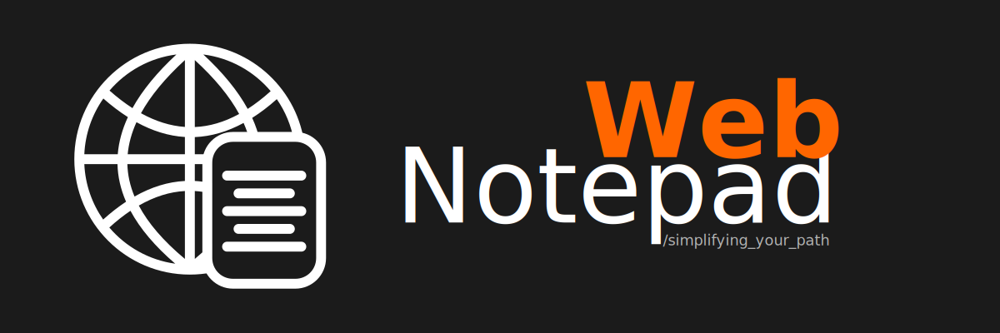

<h1></h1>

## Web Notepad

This application was made with the intention to study Front-End and Back-End, focusing on API.

Currently it's opening for someone that want something similar to use.

### Features

- Directory navigation
- Read files

#### To be implemented

- Create files/folders
- Edit file content

### Quick-start

1. Clone this repository to a directory
2. Run `npm i`
3. Run `npm start`
4. Open your browser and enter the following URL: `localhost:3000`

> At the moment, application runs on **PORT 3000**, but you can change in `src/index.js` file.
